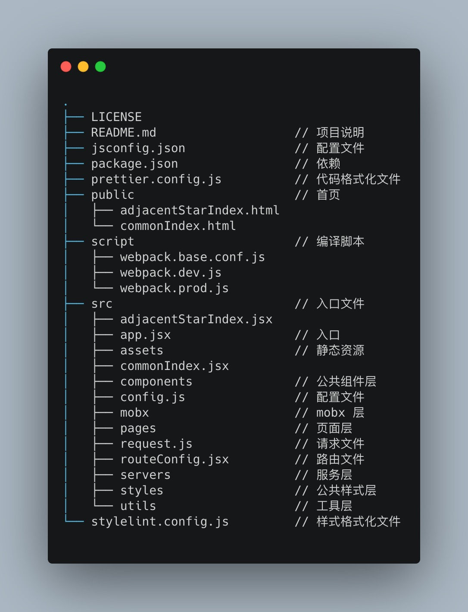

# Tristana


Tristana works on macOS, Windows, and Linux.<br>
If something doesn’t work, please [file an issue](https://github.com/xuya227939/tristana/issues/new).

## Quick Overview

```sh
npm install -g tristana
tristana init my-app
```

If you've previously installed `tristana` globally via `npm install -g tristana`, we recommend you uninstall the package using `npm uninstall -g tristana` or `yarn global remove tristana` to ensure that npx always uses the latest version.

## Directory



Once the installation is done, you can open your project folder:

```sh
cd my-app
```

Inside the newly created project, you can run some built-in commands:

### `npm start` or `yarn start`

Runs the app in development mode.<br>
Open [http://localhost:3000](http://localhost:3000) to view it in the browser.

The page will automatically reload if you make changes to the code.<br>
You will see the build errors and lint warnings in the console.

### `npm run build` or `yarn build`

Builds the app for production to the `build` folder.<br>
It correctly bundles React in production mode and optimizes the build for the best performance.

The build is minified and the filenames include the hashes.<br>

Your app is ready to be deployed.

## License

[MIT](https://tldrlegal.com/license/mit-license)
