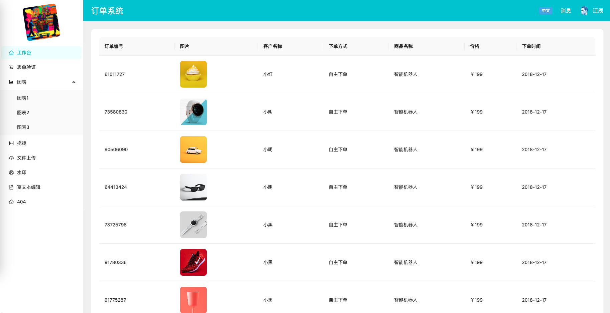
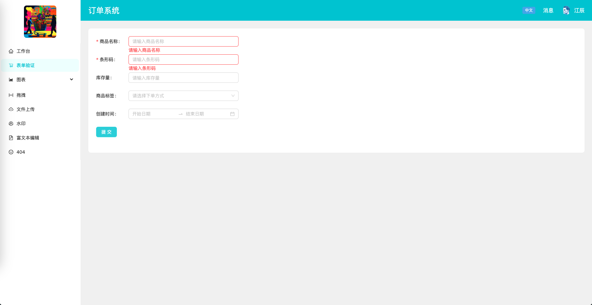
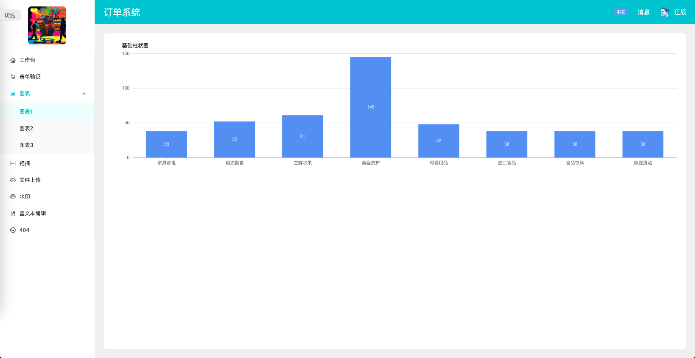
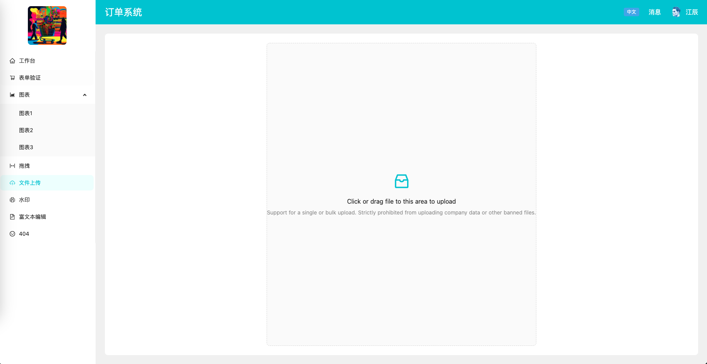
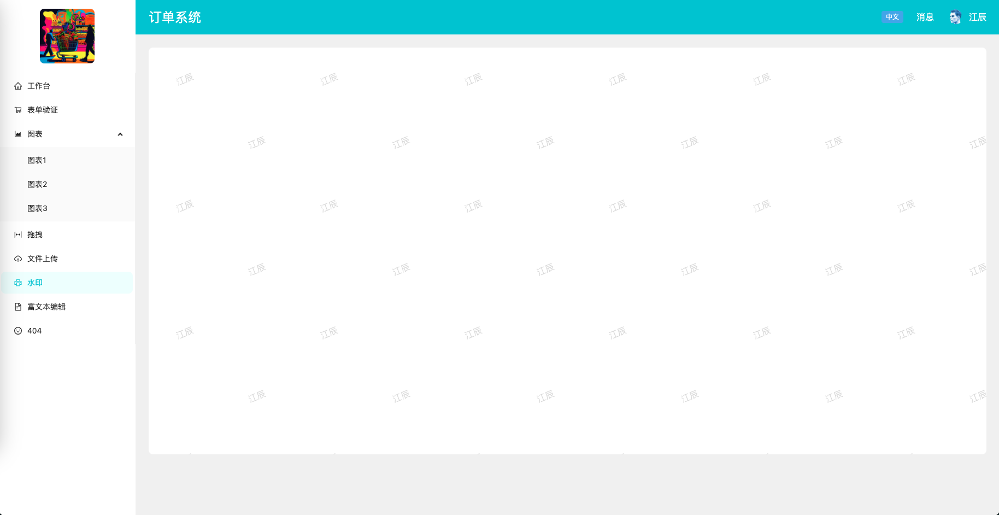
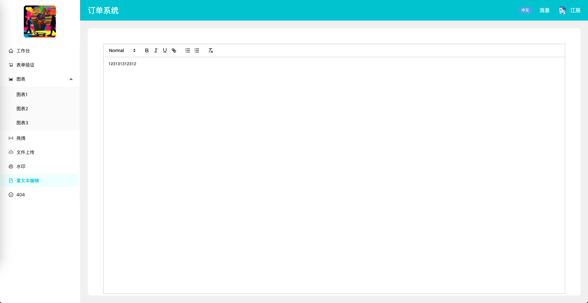
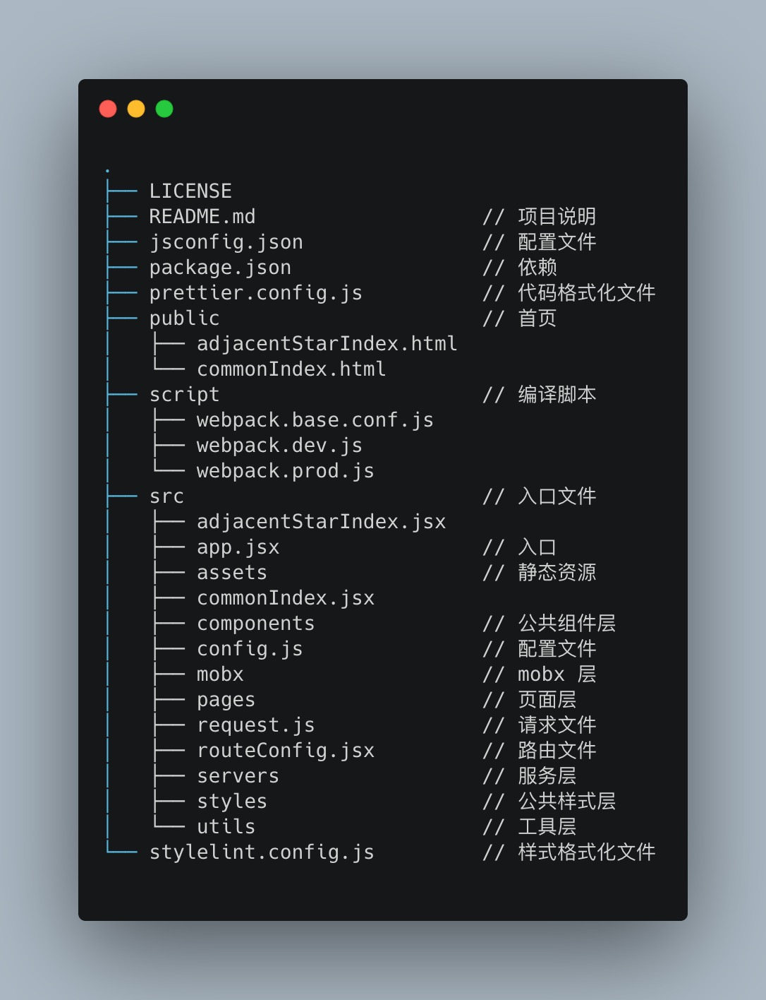

# Tristana


Tristana 在 macOS、Windows 和 Linux 上工作<br>
如果出现问题，请[提交问题](https://github.com/xuya227939/tristana/issues/new)

## 页面部分截图



## 快速开始

```sh
npm install -g tristana
tristana init my-app
```

如果您以前通过 npm install-g tristana 全局安装过 tristana，我们建议您使用 npm uninstall-g tristana 或 yarn global remove tristana 卸载该软件包，以确保 npx 始终使用最新版本

## 目录结构



安装完成后，您可以打开项目文件夹：

```sh
cd my-app
```

在新创建的项目中，您可以运行一些内置命令:

### `npm start` or `yarn start`

以开发模式运行应用程序<br>
打开 [http://localhost:3000](http://localhost:3000/#/dashboard) 以在浏览器中查看

如果您更改代码，页面将自动重新加载 <br>
您将在控制台中看到构建错误和 lint 警告

### `npm run build` or `yarn build`

将生产应用程序构建到“构建”文件夹<br>
它正确地将 React 捆绑在生产模式中，并优化构建以获得最佳性能

构建被缩小，文件名包括哈希<br>

您的应用程序已准备好部署

## License

[MIT](https://tldrlegal.com/license/mit-license)
